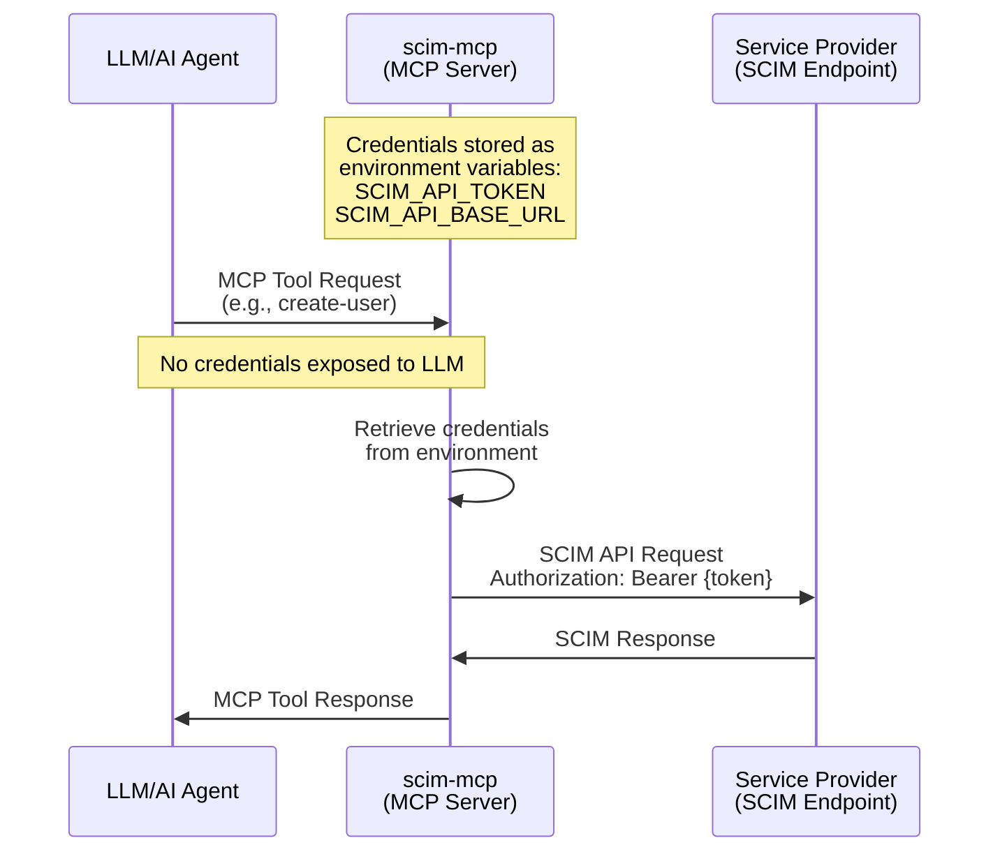

# SCIM Relay for Agents

**scim-mcp** is a SCIM (**S**ystem for **C**ross-domain **I**dentity **M**anagement) relay for AI agents. This MCP server enables LLMs to manage enterprise user identities and groups through the battle-tested SCIM 2.0 standard ([RFC7644](https://datatracker.ietf.org/doc/html/rfc7644)). It acts as a secure relay between AI agents and service providers (SP) or identity providers (IdP), allowing organizations to provision, de-provision, and manage authorization policies safely.

## Features

Full SCIM 2.0 user and group lifecycle management:

**User Operations:**
- **POST** - Create users with core and enterprise schema attributes ([RFC7644 §3.3](https://datatracker.ietf.org/doc/html/rfc7644#section-3.3))
- **GET** - Retrieve user information ([RFC7644 §3.4.1](https://datatracker.ietf.org/doc/html/rfc7644#section-3.4.1))
- **PUT** - Replace user records entirely ([RFC7644 §3.5.1](https://datatracker.ietf.org/doc/html/rfc7644#section-3.5.1))
- **PATCH** - Update specific user attributes ([RFC7644 §3.5.2](https://datatracker.ietf.org/doc/html/rfc7644#section-3.5.2))
- **DELETE** - Remove users ([RFC7644 §3.6](https://datatracker.ietf.org/doc/html/rfc7644#section-3.6))
- **Deactivation** - Disable user accounts by setting `active: false`

**Group Operations:**
- **POST** - Create groups ([RFC7644 §3.3](https://datatracker.ietf.org/doc/html/rfc7644#section-3.3))
- **GET** - Retrieve group information ([RFC7644 §3.4.1](https://datatracker.ietf.org/doc/html/rfc7644#section-3.4.1))
- **PUT** - Replace group records entirely ([RFC7644 §3.5.1](https://datatracker.ietf.org/doc/html/rfc7644#section-3.5.1))
- **PATCH** - **Add/remove users to/from groups for authorization management** ([RFC7644 §3.5.2](https://datatracker.ietf.org/doc/html/rfc7644#section-3.5.2))
- **DELETE** - Remove groups ([RFC7644 §3.6](https://datatracker.ietf.org/doc/html/rfc7644#section-3.6))

## Use Cases

1. **Connect Enterprise App Directly** - Manage users and groups directly in your service provider without Azure AD, Okta, or other IdP interfaces
2. **SCIM Endpoint Development & Testing** - Validate your SCIM endpoint implementation without setting up Azure AD or Okta
3. **Control MCP Server Access** - Use Auth0's [inbound SCIM connector](https://auth0.com/docs/authenticate/protocols/scim/configure-inbound-scim#leverage-integration-galleries-for-streamlined-setup) to manage which OAuth accounts can access which MCP servers

## Demo

On Vercel
<https://scim-mcp.vercel.app/mcp>

On Alpic
<https://scim-mcp-d8a54d7b.alpic.live/>

[](https://app.alpic.ai/new/clone?repositoryUrl=https://github.com/chenhunghan/scim-mcp)

## Architecture



## Setup

### Codex

```toml
[mcp_servers.scim]
command = "npx"
args = ["-y", "mcp-remote@latest", "https://scim-mcp-d8a54d7b.alpic.live/", "--header", "x-scim-api-token:${SCIM_AUTH_TOKEN}", "--header", "x-scim-base-url:https://service.provider.scim.base.url"]
```

## Development

First, run the development server:

```sh
npm run dev
```
